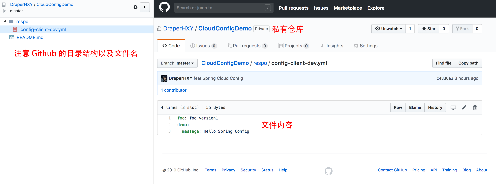
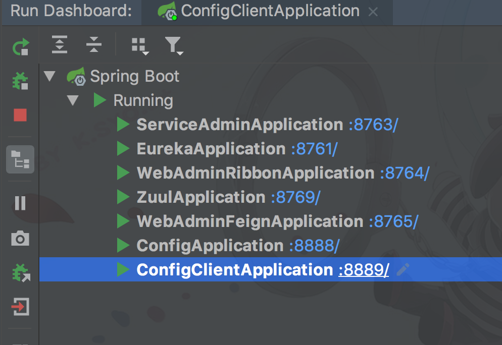

# 快速上手

* SpringCloud 版本 Finchley.RELEASE


## 准备工作

### 一、远程 github 账号密码

> 如果不需要云配置功能则跳过一二步
>
> 并不要启动 ``hello-spring-cloud-config`` 和 ``hello-spring-cloud-config-client``

远程 github 仓库是为了实现云配置，云应用的概念

> 在该项目中，只是为了体验，并不进行真正的配置

在 ``hello-spring-cloud-config`` 工程下 ``src/main/resources`` 下创建 ``application-git.yml``

其内容格式为

```yaml
git:
  uri: https://github.com/DraperHXY/CloudConfigDemo
  search-paths: /respo
  username: 
  password: 
```

> 项目的配置使用了 github 私有仓库，所以要账号密码
>

* ``uri `` 为自己的仓库，如果是 github 结尾不要加 .git
* ``search-paths`` 配置在仓库中的文件目录
* ``username`` github 账号
* ``password`` github 密码


### 二、创建远程仓库





### 三、配置 Docker

配置 ZipKin 进行服务链追踪

```bash
docker run -d -p 9411:9411 openzipkin/zipkin
```


## 运行

按照以下顺序依次运行

*  ``hello-spring-cloud-eureka`` 服务注册中心
* ``hello-spring-cloud-service-admin`` 服务提供者
* ``hello-spring-cloud-web-admin-ribbon`` 服务消费者
* ``hello-spring-cloud-web-admin-feign`` 服务消费者
* ``hello-spring-cloud-zuul`` API 网关
* ``hello-spring-cloud-config`` 远程配置服务
* ``hello-spring-cloud-config-client`` 配置引用客户端


如果可以用 Dashboard 运行，一目了然




# 实现功能

* 服务注册中心 Eureka Server
* 服务提供者 Eureka Client
* 服务消费者
  * Ribbon + RestTemplate
  * Feign
* 熔断器 Hystrix
* 智能路由 Zuul
* 配置管理 Config
* 服务追踪组件 ZipKin


# 监控

[http://localhost:8761/](http://localhost:8761/)

[http://localhost:8765/hystrix/](http://localhost:8765/hystrix/)

[http://localhost:9411/](http://localhost:9411)

